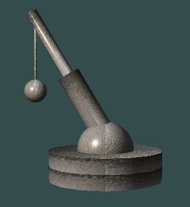
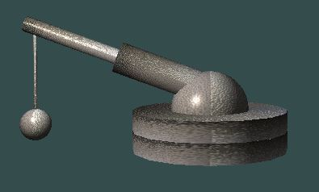
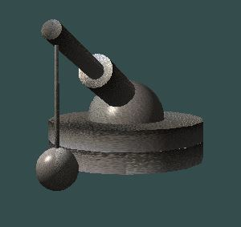
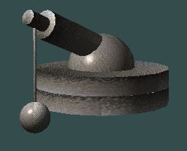
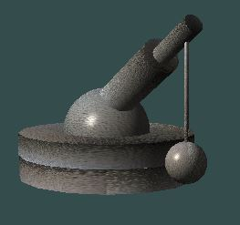

# OpenGL Crane Scene

A real-time 3D graphics project built with modern OpenGL that simulates a fully interactive crane system with hierarchical transformations, custom geometry generation, and real-time user input control.

---

## Features

- Custom vertex and fragment shaders (GLSL)
- Phong lighting model (ambient, diffuse, specular)
- Point light attenuation for realistic light falloff
- Texture mapping using UV coordinates
- Per-vertex normals for accurate lighting
- Procedural geometry generation using triangle strips and triangle fans
- VBO/VAO-based GPU rendering pipeline
- Hierarchical transformations (scale, translate, rotate)
- Fully interactive crane mechanics with real-time input

---

## Crane System

The entire crane is built using two procedural primitives:

- `DrawRoller()` – used for cylindrical parts of the structure  
- `DrawSphere()` – used for joint connections and rotation pivots  

All components are connected through a hierarchical transformation system, where each part depends on the transformation state of its parent.

---

## Controls

The crane supports three main degrees of motion:

- Q / W – Rotate crane base around the XZ axis  
- A / S – Rotate crane arm joint (XY axis)  
- Z / X – Extend/retract the telescopic arm segment  

Each movement affects dependent components through transformation propagation.

---

## Architecture

Central rendering class:

```cpp
class CRenderer
{
private:
    unsigned int shaderProgram;
    float joint1;
    float joint2;
    float joint3;
    GLFWwindow* window;
    void CompileShaders();

public:
    CRenderer(GLFWwindow *window);
    void HandleInput();
    void DrawRoller(float r, float h, int nPartXZ, int nPartY);
    void DrawSphere(float r, int nPartXZ, int nPartY);
    void SetMaterial(float r, float g, float b);
    int PrepareTextures(std::string strTex);
    void DrawCrane(float r, float h, int nPartXZ, int nPartY, unsigned int textureID, float cameraAngle);
};
```

---

## Technologies Used

- OpenGL  
- GLFW  
- GLM  
- GLAD  
- GLSL  
- C++ Standard Library  

---

## Implementation Details

- Uses Phong shading model with per-pixel lighting  
- Implements point light attenuation  
- Uses VAO/VBO buffers for GPU communication  
- Geometry is generated procedurally at runtime  
- UV coordinates are used for texture mapping  
- Hierarchical transformations ensure realistic crane behavior  
- Each joint affects child components dynamically  

---

## Notes and screenshots

This project focuses on fundamental computer graphics concepts such as shader programming, lighting models, geometric primitives, and transformation hierarchies in a real-time rendering pipeline.






